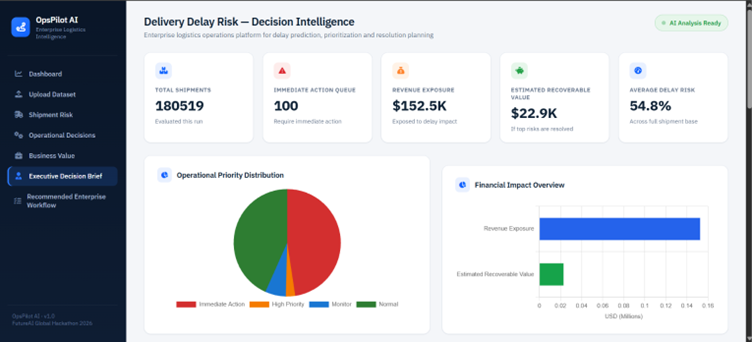

# 🚀 OpsPilot AI

<br>

### Agentic Decision Intelligence for Enterprise Logistics

> **Prediction tells you what might happen. OpsPilot AI tells you what to do next.**

OpsPilot AI is an AI-powered decision intelligence platform that goes beyond shipment delay prediction. Instead of simply identifying high-risk shipments, it combines **Machine Learning** with **five specialized AI agents** to help operations teams prioritize risks, understand business impact, generate executive insights, and recommend enterprise-ready actions.

Built for the **FutureAI Global Hackathon 2026**.

<br><br>

---

<br><br>

## 📸 Dashboard Preview

<p align="center">
  
</p>

<br><br>

---

<br><br>

## 🌟 Why OpsPilot AI?

Enterprise logistics teams already have dashboards and reports.

The real challenge isn't collecting data—it's **turning data into decisions.**

OpsPilot AI transforms thousands of shipment records into:

- 🚨 Prioritized shipment risks
- 📊 Operational decision intelligence
- 💰 Business impact analysis
- 📝 AI-generated executive summaries
- ✅ Enterprise action plans

Instead of asking:

> **"Which shipments are delayed?"**

OpsPilot AI answers:

> **"Which shipments should I act on first, why, and what should I do next?"**

<br><br>

---

<br><br>

## ⚙️ System Workflow

```text
Shipment Dataset (CSV)
          │
          ▼
CatBoost Machine Learning Model
(Predicts Delay Risk)
          │
          ▼
Shipment Risk Agent
          │
          ▼
Decision Intelligence Agent
          │
          ▼
Business Value Agent
          │
          ▼
Executive Summary Agent
          │
          ▼
Resolution Planning Agent
          │
          ▼
Enterprise Decision Dashboard
```

Each AI agent performs a dedicated task, creating a modular decision-support workflow rather than relying on a single AI response.

---

## ✨ Key Features

- Machine Learning-based shipment delay prediction using CatBoost
- Five specialized AI agents for enterprise decision intelligence
- Shipment risk prioritization
- Business impact estimation
- AI-generated executive decision briefs
- Enterprise workflow recommendations
- Modern web-based dashboard

---

## 🤖 AI Agent Architecture

### 📦 Shipment Risk Agent

Predicts shipment delay probability and classifies operational risk.

### 🎯 Decision Intelligence Agent

Prioritizes shipments requiring immediate operational attention.

### 💰 Business Value Agent

Estimates operational and financial impact of shipment delays.

### 📄 Executive Summary Agent

Generates concise AI-powered executive insights.

### 📋 Resolution Planning Agent

Recommends enterprise-ready operational action plans.

---

## 🛠 Tech Stack

- **Machine Learning:** Python, CatBoost, Scikit-learn, Pandas, NumPy, Joblib
- **Artificial Intelligence:** Google Gemini API
- **Backend:** Flask
- **Frontend:** HTML5, CSS3, JavaScript
- **Deployment:** Render
- **Version Control:** Git, GitHub

---

## 📊 Dataset

The current prototype is demonstrated using the **DataCo Smart Supply Chain Dataset**.

The architecture is designed to be retrained on an organization's own shipment dataset while preserving the same AI-powered decision workflow.

---

## 🚀 Live Demo

- 🌐 **Web Application:** https://opspilot-ai-1.onrender.com
- 📓 **Machine Learning Notebook:** The complete machine learning workflow—including preprocessing, feature engineering, CatBoost training, model evaluation, and model generation—is available in Google Colab.

  **Notebook:** https://colab.research.google.com/drive/1slnS1CWL8rgnOyhdvoXcL09g4jAIYm0N?usp=sharing

---

## ▶️ Running Locally

### 1. Clone the repository

```bash
git clone https://github.com/YOUR_USERNAME/OpsPilot-AI.git
cd OpsPilot-AI
```

### 2. Install dependencies

```bash
pip install -r requirements.txt
```

### 3. Create a `.env` file

```env
GEMINI_API_KEY=YOUR_GEMINI_API_KEY
```

### 4. Run the application

```bash
python app.py
```

Open your browser and visit:

```
http://127.0.0.1:5000
```

---

## 📁 Project Structure

```text
OpsPilot-AI/
│
├── app.py
├── model.pkl
├── preprocessor.pkl
├── requirements.txt
├── DataCoSupplyChainDataset.csv
├── templates/
├── static/
│   ├── css/
│   ├── js/
│   └── screenshots/
│       └── Picture1.png
├── screenshots/
│   └── Picture1.png
└── README.md
```

---

## 🔮 Future Enhancements

- Support schema mapping for organization-specific shipment datasets.
- Enable model retraining using enterprise historical shipment data.
- Integrate with ERP/WMS platforms.
- Enable real-time shipment monitoring.
- Evolve into event-driven autonomous AI agents.
- Build continuous learning feedback loops using operational outcomes.

---

## 👩‍💻 Author

**Rithika Rajeev**

B.Tech Computer Science Engineering  
VIT Vellore

---

## ⭐ Acknowledgements

Developed for the **FutureAI Global Hackathon 2026** as an enterprise AI solution demonstrating how Machine Learning and Agentic AI can transform logistics operations from prediction to actionable decision intelligence.
